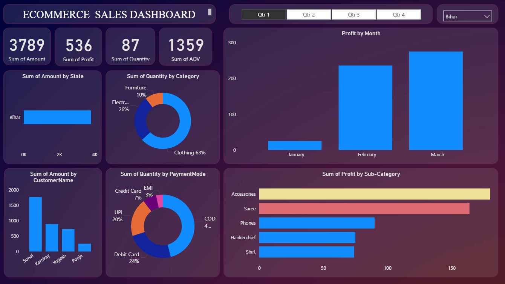

# 📊 Online Sales Data Analysis Dashboard

## 📖 Project Overview
This project focuses on analyzing online sales data using Power BI to generate meaningful business insights. The dashboard provides a comprehensive view of sales performance, profit trends, customer behavior, and product analysis through interactive visualizations.

## 🎯 Objectives
- Analyze sales and profit trends over time  
- Identify top-performing products and categories  
- Understand customer purchasing behavior  
- Enable data-driven decision-making using interactive dashboards  

## 🛠️ Tools & Technologies
- Power BI  
- Microsoft Excel  
- CSV (Data Files)  

## 📂 Dataset
- Orders.csv  
- Details.csv  

## 📊 Dashboard Features
- Interactive dashboard with filters and slicers (Quarter, State)  
- KPI cards showing Total Sales Amount, Profit, Quantity, and Average Order Value (AOV)  
- Sales analysis by state and customer  
- Category-wise and sub-category-wise performance analysis  
- Monthly profit trend visualization  
- Payment mode distribution analysis  
- Dynamic filtering for better data exploration  

## 📈 Key Insights
- Identified top-performing categories contributing to maximum sales  
- Analyzed monthly profit trends to track business growth  
- Observed customer purchasing patterns and high-value customers  
- Evaluated preferred payment modes used by customers  

## 📸 Dashboard Preview

## 🚀 Outcome
Developed an interactive and user-friendly dashboard that helps in understanding large datasets, identifying trends, and supporting business decisions through data visualization.

## 🔗 Project Files
- Power BI Template: `project1.pbit`  
- Dataset: `Orders.csv`, `Details.csv`  

## 📌 Author
Shubham Sahoo
